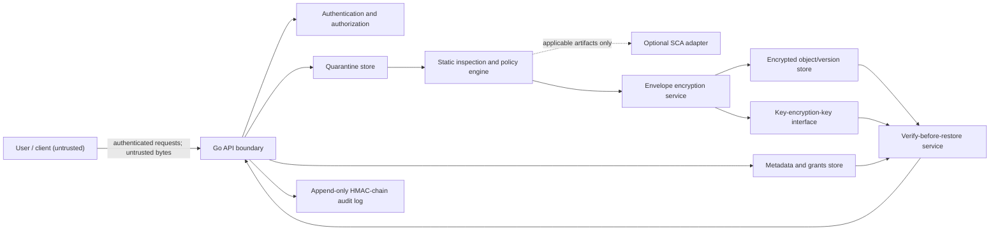

# Architecture

## Architectural goal

The system controls a file from untrusted upload through verified recovery. It separates trust zones, uses explicit lifecycle states, and denies access when inspection, authorization, integrity, or audit verification is uncertain.

## Context and trust boundaries

Trust boundaries:

1. Client to API: all identities, metadata, names, and bytes are untrusted.
2. API to quarantine: content remains untrusted and unavailable for retrieval.
3. Inspection to protected storage: only a policy-approved file may cross this boundary.
4. Application to key interface: key access is separate from ciphertext access.
5. Operational data to audit verification: log readers must not be assumed able to rewrite history undetected.
6. Stored version to recovery: an existing version is a candidate, not trusted plaintext, until verification succeeds.

## Components and responsibilities

| Component | Responsibility | Must not do |
|---|---|---|
| API boundary | authenticate requests, enforce size/time limits, normalize metadata, coordinate use cases | trust client lifecycle states or paths |
| Authentication | establish identity and session validity | grant file access by itself |
| Authorization | evaluate operation, subject, resource, grant status, and lifecycle state | rely only on UI visibility |
| Quarantine | isolate new bytes with generated identifiers and restrictive access | expose downloads or executable paths |
| Inspector | identify type from content, apply static checks, produce evidence | execute or render uploaded active content |
| SCA adapter | inspect supported manifests/packages when configured | run for arbitrary files or replace malware checks |
| Policy engine | convert evidence into accept/reject decisions | accept on scanner error or timeout |

### Malware-scanner adapter

The development adapter is deterministic and cannot provide malware assurance. The production-oriented adapter connects to ClamD over a configured TCP or Unix socket and uses the NUL-framed `INSTREAM` protocol. It streams the exact opaque quarantine object in bounded chunks; it never sends a client-controlled filename or host path for daemon-side resolution. Immediately before each scan, the adapter requires safely parsed engine, database-version, and UTC database-timestamp evidence within the configured maximum age. Missing, stale, malformed, or materially future-dated evidence fails closed. Only `OK`, `FOUND`, and failure classes cross back into lifecycle policy. Signature names, daemon addresses, paths, and raw scanner diagnostics are excluded from persisted records and API responses. The deployment package keeps ClamD off public ingress and uses a persistent database shared with an hourly FreshClam updater that notifies the daemon after changes.

The application accepts a file only after a clean `OK` result. Detection becomes `malware_detected`; connection failures, timeouts, protocol errors, size-limit errors, unreadable quarantine objects, and all unknown responses become `inspection_unavailable`. Both outcomes remove quarantine plaintext and never create protected storage. Scanner posture is production-ready only when live `PING` and safely parsed `VERSION` evidence succeed.

### Managed key-custody adapter

The development keyring holds versioned KEKs in process memory and is never production-ready. The production adapter uses a private mutually authenticated HTTPS broker with only status, wrap, and unwrap operations. The broker maps safe application aliases to non-exportable managed KMS/HSM versions. Requests bind one DEK to the exact key identity and envelope purpose; strict bounded responses must repeat the authoritative identity. Redirects, plaintext transport, unknown fields, provider diagnostics, software-only custody, and dependency failures cannot create production assurance and cryptographic operations fail closed without local fallback. See [ADR 0002](adr/0002-managed-key-broker-boundary.md).

### Independent audit-anchor adapter

The PostgreSQL audit chain atomically maintains its current checkpoint. The local development adapter separately HMAC-signs checkpoints into an on-host append-only file, while the production adapter sends only checkpoint metadata to an independently administered immutable ledger over mTLS. The ledger attests the exact receipt with Ed25519; SecureStore pins only the public verification key and compares the latest trusted receipt with the database chain head. Invalid signatures, mismatched fields, unknown JSON, redirects, plaintext transport, shared administration, mutable storage, or anchoring lag cannot create production assurance. See [ADR 0003](adr/0003-independent-audit-checkpoint-anchor.md).

| Crypto service | generate DEKs, encrypt/decrypt with AES-256-GCM, bind metadata as AAD | persist plaintext DEKs or reuse nonces |
| Storage | persist immutable ciphertext versions and metadata | infer authorization from object knowledge |
| Audit service | append canonical HMAC-linked events and verify chains | store secrets or plaintext file contents in events |
| Recovery | verify version, authorization, key material, AEAD tag, and expected metadata before restore | overwrite the current version before verification |

## Data model outline

- `User`: immutable ID, authentication state, role, status.
- `File`: immutable ID, owner ID, current lifecycle state, current version ID, policy classification.
- `FileVersion`: immutable ID, file ID, sequence, ciphertext locator, wrapped DEK, nonce, algorithm/version, AAD fields, size and digests, creation metadata.
- `Grant`: subject, file, allowed actions, issuer, creation and revocation data.
- `Inspection`: file/version, tool and policy versions, evidence summary, decision, timestamps.
- `AuditEvent`: sequence, time, actor, action, resource, outcome, correlation ID, previous MAC, MAC.
- `RestoreJob`: source version, requester, verification result, output version, status.

## Invariants

- Lifecycle transitions are atomic with their authoritative metadata change.
- Quarantined content is not addressable through the download path.
- Each accepted plaintext version gets a fresh 256-bit DEK and unique GCM nonce.
- Authorization is checked at request time, including after a grant is revoked.
- Ciphertext and wrapped keys alone do not establish integrity; AEAD verification is mandatory.
- A restore creates a new current version or an atomic pointer change only after full verification.
- Security-relevant success and failure outcomes produce audit events.
- Scanner, key, storage, or audit failures fail closed for sensitive operations.

## Availability and consistency

Long-running inspection and restoration may be represented as jobs. State changes use compare-and-swap or transactions so retries cannot skip states. Idempotency keys protect upload finalization and restore requests from duplicate effects. Temporary plaintext is bounded, access-restricted, and removed on success, failure, cancellation, and startup reconciliation.
